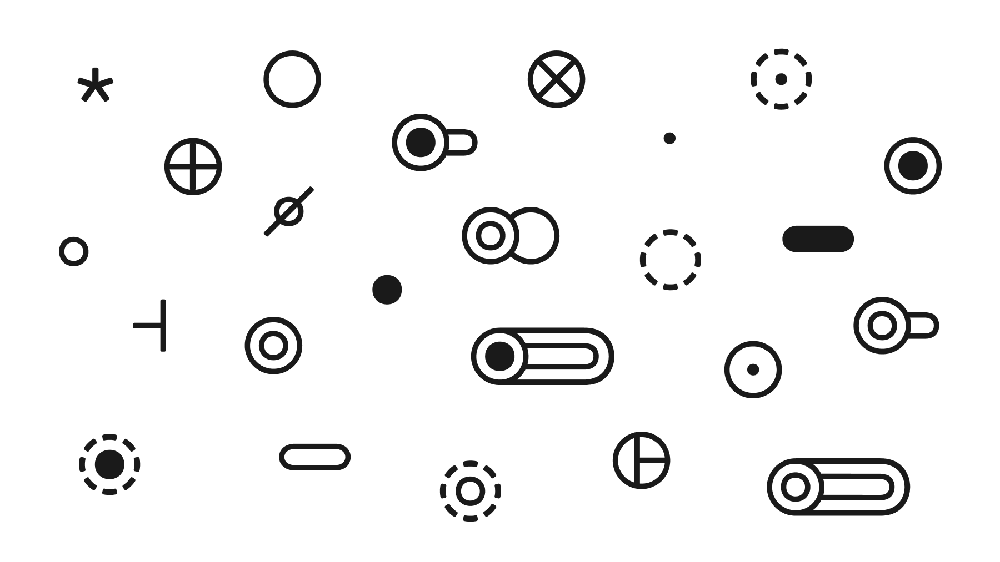

# Operators generator for Я written in Я itself

- [x] Generate complete valid operators code
- [ ] Source and target categories should be different
- [ ] Generate operators with source Kleisli morphisms
- [ ] Generate operators with target Kleisli morphisms
- [ ] Generate longer versions of the same definition
- [ ] Generate Hom functor aliases
